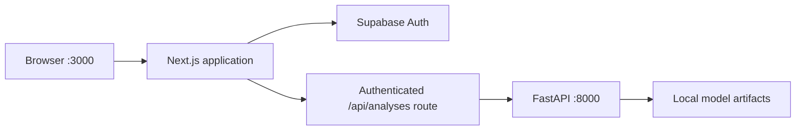

# Launchly - Product Success Predictor

Launchly is a decision-support application for Beauty and Personal Care product ideas. The local environment combines a Next.js frontend, Supabase authentication, and a FastAPI service that serves the product-success model.

> **Current scope:** Next.js forwards verified Supabase sessions to a modular FastAPI backend. Versioned Supabase migrations implement RLS-protected analysis history, finance results, Store, shortlist, and a Power BI view. Remote migration deployment and production hosting remain operational steps; simulated dashboard sources remain explicitly labelled.

## Local architecture



| Service | Local address | Purpose |
|---|---|---|
| Next.js | `http://localhost:3000` | User interface, session handling, and API proxy |
| FastAPI | `http://127.0.0.1:8000` | Model inference API |
| FastAPI health | `http://127.0.0.1:8000/health` | Backend readiness check |
| FastAPI docs | `http://127.0.0.1:8000/docs` | Interactive API documentation |
| Supabase | Hosted project | Auth, RLS-protected application data, analysis history, and Store |

## Prerequisites

Install these tools before starting:

- Git.
- Python 3.11 recommended; Python 3.10 or later is supported by the backend.
- Node.js 22 or 24 LTS. Next.js requires Node.js `>=20.9.0`.
- pnpm 11.
- A Supabase project with Email authentication enabled.
- The model artifacts listed in [Backend model artifacts](#backend-model-artifacts), or the source dataset required to generate them.

Check the active versions in PowerShell:

```powershell
node --version
python --version
pnpm.cmd --version
```

If `node --version` reports Node 18, install or activate Node 22/24 before installing frontend dependencies. Reopen PowerShell afterward and run `where.exe node` to confirm which executable is active.

To install pnpm through Corepack:

```powershell
corepack enable
corepack prepare pnpm@11.9.0 --activate
pnpm.cmd --version
```

On Windows, this guide uses `pnpm.cmd` because it also works when PowerShell blocks the `pnpm.ps1` script. On macOS or Linux, use `pnpm` instead.

## 1. Open the project

Clone the repository if necessary, then open PowerShell at the repository root:

```powershell
git clone <repository-url>
cd amazon-reviews-london-ads-2026
```

All commands below assume this directory is the repository root unless the command changes directories explicitly.

## 2. Configure the FastAPI backend

Create and activate a virtual environment:

```powershell
python -m venv .venv
.\.venv\Scripts\Activate.ps1
python -m pip install --upgrade pip
python -m pip install -r src/api/requirements.txt
```

If PowerShell blocks virtual-environment activation, allow local scripts for the current process only, then retry:

```powershell
Set-ExecutionPolicy -Scope Process -ExecutionPolicy Bypass
.\.venv\Scripts\Activate.ps1
```

### Backend model artifacts

The API requires these local files:

```text
output/models/model.pkl
output/models/calibrator_1d.pkl
output/models/knn_index.pkl
output/models/tfidf_vectorizer.pkl
output/models/feature_names.json
output/models/subcategory_stats.json
output/models/density_reference.npy
output/predictions/scored_catalog.csv
```

Large model and data files are intentionally excluded from Git. For a clean clone, either copy an approved artifact bundle into the paths above or regenerate it locally.

To regenerate the artifacts, place the private source dataset at `Master_Beauty_Dataset.csv` in the repository root. Never commit this file. Then run:

```powershell
python src/ml/run_pipeline.py
python src/ml/fix_calibration_shap.py
```

See [Backend runbook](docs/18_BACKEND_RUNBOOK.md) for the artifact contract, pipeline notes, and backend-only troubleshooting.

## 3. Configure Supabase and the frontend

Create a Supabase project, enable Email authentication, and obtain these public values from the Supabase project settings:

- Project URL.
- Publishable key. A legacy anonymous key may be used only if the project does not expose the newer publishable key.

Create the local environment file:

```powershell
cd src/frontend
Copy-Item .env.example .env.local
```

Edit `src/frontend/.env.local`:

```dotenv
NEXT_PUBLIC_SUPABASE_URL=https://your-project.supabase.co
NEXT_PUBLIC_SUPABASE_PUBLISHABLE_KEY=sb_publishable_replace_me
NEXT_PUBLIC_SITE_URL=http://localhost:3000
FASTAPI_URL=http://127.0.0.1:8000
NEXT_PUBLIC_ENABLE_DEMO_MODE=true
```

`FASTAPI_URL` is server-only and must not use the `NEXT_PUBLIC_` prefix. Do not commit `.env.local`, secret keys, service-role keys, datasets, or model artifacts.

In **Supabase Dashboard > Authentication > URL Configuration**, set:

- Site URL: `http://localhost:3000`
- Redirect URL: `http://localhost:3000/auth/confirm`
- Redirect URL: `http://localhost:3000/reset-password`

For email confirmation, configure the confirmation template to return the token hash to the application:

```text
{{ .SiteURL }}/auth/confirm?token_hash={{ .TokenHash }}&type=email
```

Install the frontend dependencies:

```powershell
pnpm.cmd install
```

Application tables, RLS policies, RPCs, and the Power BI view are versioned under `supabase/`. Follow [the Supabase runbook](docs/backend/04_SUPABASE_RUNBOOK.md) to validate and deploy them; do not edit the remote schema directly.

## 4. Run the complete environment

Keep two PowerShell terminals open.

### Terminal 1 - FastAPI

From the repository root:

```powershell
.\.venv\Scripts\Activate.ps1
cd src/api
python -m uvicorn main:app --reload --host 127.0.0.1 --port 8000
```

Confirm that `http://127.0.0.1:8000/health` returns a healthy response. If the API reports missing artifacts, complete the artifact step before continuing.

### Terminal 2 - Next.js

From the repository root:

```powershell
cd src/frontend
pnpm.cmd dev
```

Open `http://localhost:3000`. Register an account, confirm the email if confirmation is enabled, and sign in. Next.js verifies the Supabase claims and forwards the access token to FastAPI, which independently validates it before inference or persistence.

When `NEXT_PUBLIC_ENABLE_DEMO_MODE=true`, the interface can show deterministic demo results if the model API is unavailable. A demo result does not prove that the FastAPI integration is working; verify the backend health endpoint and terminal logs.

## 5. Validate the environment

Backend health:

```powershell
Invoke-RestMethod http://127.0.0.1:8000/health
```

Frontend checks:

```powershell
cd src/frontend
pnpm.cmd typecheck
pnpm.cmd lint
pnpm.cmd test
pnpm.cmd build
```

Run `pnpm.cmd build` with production-like environment values before deployment. Browser end-to-end tests are available with `pnpm.cmd e2e` when the required test browser is installed.

## Windows troubleshooting

### Next.js requires Node.js 20.9 or later

Symptom:

```text
You are using Node.js 18.x. For Next.js, Node.js version >=20.9.0 is required.
```

Install or activate Node.js 22/24 LTS, close the old terminal, and verify:

```powershell
where.exe node
node --version
```

Do not reinstall the frontend packages until the correct Node executable is active.

### `EPERM` while replacing `next-swc.win32-x64-msvc.node`

The native Next.js compiler is locked by a Node process, antivirus scanner, or OneDrive synchronization. Stop active Next.js/Node processes, close terminals using the frontend, and temporarily pause OneDrive synchronization if necessary. Then run the cleanup only from `src/frontend`:

```powershell
if ((Split-Path (Get-Location) -Leaf) -ne 'frontend') {
    throw 'Run this command only from src/frontend.'
}

Remove-Item -LiteralPath .\node_modules -Recurse -Force
pnpm.cmd install
```

If Windows still reports `EPERM`, restart Windows and repeat these commands before starting any development server. Moving the repository outside a synchronized OneDrive directory can also prevent recurring native-file locks.

### `next` is not recognized

This normally means the prior dependency installation was interrupted. Fix the Node version or file lock first, remove the incomplete `node_modules` directory using the guarded command above, and run:

```powershell
pnpm.cmd install
pnpm.cmd dev
```

### `pnpm.ps1` cannot be loaded

Use the Windows command shim:

```powershell
pnpm.cmd install
pnpm.cmd dev
```

### Login or registration fails

Check that:

- `.env.local` contains the correct Supabase project URL and publishable key.
- Email authentication is enabled in Supabase.
- Site and redirect URLs exactly match the local URLs above.
- The Supabase project is active and reachable.

Restart `pnpm.cmd dev` after changing `.env.local`.

### FastAPI starts but analysis fails

Check the backend terminal for the exact missing artifact or incompatible model error. Confirm that all files in the artifact list exist and were generated with compatible package versions. The detailed recovery procedure is in [docs/18_BACKEND_RUNBOOK.md](docs/18_BACKEND_RUNBOOK.md).

## Project structure

```text
amazon-reviews-london-ads-2026/
|-- docs/                 Product, architecture, API, and runbook documentation
|-- output/               Local generated models, predictions, and metrics
|-- src/
|   |-- api/              FastAPI model service
|   |-- frontend/         Next.js application and Supabase Auth integration
|   `-- ml/               Training, calibration, and validation pipelines
|-- supabase/             Versioned migrations, RLS, RPCs, seeds, and pgTAP tests
|-- tests/                Python model and formula tests
`-- README.md             Complete local setup guide
```

## Documentation

| Document | Purpose |
|---|---|
| [Documentation index](docs/00_INDEX.md) | Canonical documentation entry point |
| [Master PRD](docs/01_PRD_MASTER.md) | Product vision, scope, and constraints |
| [HTML MVP mapping](docs/04_HTML_MVP_MAPPING.md) | Prototype-to-application mapping |
| [Architecture and hosting](docs/08_ARCHITECTURE_HOSTING.md) | Target architecture and deployment model |
| [API and database](docs/09_API_DATABASE.md) | API contracts and implemented Supabase schema |
| [Backend implementation](docs/backend/README.md) | Architecture, RLS, API, migrations, and operations |
| [Definition of Done](docs/14_DEFINITION_OF_DONE.md) | MVP completion criteria |
| [Backend runbook](docs/18_BACKEND_RUNBOOK.md) | FastAPI setup, artifacts, and operations |
| [Next.js frontend](docs/19_NEXTJS_FRONTEND.md) | Frontend architecture and behavior |
| [Supabase auth and database](docs/20_SUPABASE_AUTH_DATABASE.md) | Authentication flows, endpoints, and database design |
| [Frontend README](src/frontend/README.md) | Frontend-specific development guide |
| [API README](src/api/README.md) | Backend-specific API guide |

## Data and security rules

- Never commit `.env.local`, Supabase service-role keys, passwords, raw datasets, private CSV/Parquet files, serialized models, or embeddings.
- Only the Supabase publishable key belongs in browser-accessible environment variables.
- Keep `FASTAPI_URL` server-only.
- Restrict FastAPI CORS and disable demo mode before production deployment.
- Treat the Success Score as a calibrated historical proxy, Decision Risk as an index, and profit as valid only when cost assumptions are complete.
