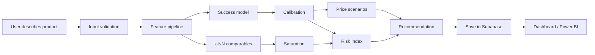

# Master PRD - Launchly

> **Implementation status — 20 July 2026:** The data-science pipeline, calibrated model, validation battery, and local FastAPI inference service are implemented. The MVP is not complete: persistence, profit calculations, Power BI export, production deployment, security controls, and reproducible model artifacts remain outstanding. See [Backend Runbook](18_BACKEND_RUNBOOK.md) for local execution.

## 1. Executive summary

Launchly is a web application that helps small entrepreneurs evaluate a Beauty and Personal Care product idea before investing. The solution combines historical Amazon data, machine learning, comparable-product analysis, and financial rules to produce a readable recommendation.

The proposal does not guarantee sales. Its promise is to reduce uncertainty and explain why an idea resembles, or does not resemble, successful historical patterns.

## 2. Problem

Entrepreneurs usually decide category, positioning, and price through intuition or manual research. Market research is expensive and does not provide a fast answer to questions such as:

- Does the product resemble historically successful cases?
- Is the price within a defensible range?
- How much local competition exists?
- What risks does the model detect?
- What margin remains after costs and fees?
- Which products are the closest comparables?

## 3. Product objective

Build a functional MVP that receives a product proposal and returns:

1. A calibrated Success Score from 0 to 100.
2. A Decision Risk index from 0 to 100, explicitly labeled as an index.
3. Profit per Sale calculated with real or clearly stated assumed costs.
4. Comparable products and market saturation.
5. Price vs. Success curves and alternative scenarios.
6. An explanation with positive factors, negative factors, and limitations.
7. Analysis persistence and export for Power BI.

## 4. Target user

- Solo entrepreneur.
- Small business or emerging brand.
- Analyst who needs to compare product ideas.
- Academic team validating a predictive hypothesis.

## 5. Jobs to be Done

> When I have a product idea, I want to compare it against historical evidence so I can decide whether to test it, modify it, or discard it before committing capital.

## 6. Value proposition

- Unifies data analysis, ML, and finance in one experience.
- Explains the result instead of only returning a percentage.
- Allows price simulations without rebuilding the analysis manually.
- Preserves traceability: model version, sources, date, and evidence quality.

## 7. MVP scope

### Included - P0

- Beauty and Personal Care and clean subcategories.
- Product input form.
- Baseline success model and calibration.
- Comparable products via cosine similarity.
- Local market saturation.
- Risk Index.
- Profit per Sale and Expected Profit with explicit assumptions.
- Price scenarios.
- Basic local explanation.
- Persistence in Supabase.
- Results dataset consumable from Power BI.

### Delivered in the current repository revision

- Calibrated Random Forest success model with documented holdout, calibration, leakage, permutation, stability, and per-subcategory validation.
- Local FastAPI service for success prediction, comparables, saturation, price-score scenarios, and combined analysis.
- HTML dashboard integration with a live-model badge and an explicitly labeled demo fallback.

### Still required to close the MVP

- Implement profit per sale and expected profit using the documented cost inputs.
- Persist analyses and expose analysis retrieval/history through Supabase.
- Produce a versioned Power BI dataset.
- Publish or reproducibly regenerate the model and catalog artifacts from a clean checkout.
- Add production authentication, RLS, HTTPS, request IDs, rate limiting, logs, and deployment.

### Added later - P1

- Review sentiment and topics.
- Temporal demand forecasting.
- Trend Radar.
- Discover Trending.
- My Store portfolio.
- Full SHAP explanations.

### Experimental - P2

- Age distribution estimation based on names.
- Amazon Seller integration.
- Automated listing publication.
- Multi-country and multi-currency support.

## 8. MVP non-goals

- Guarantee sales or profitability.
- Infer the exact age of a person.
- Automate an investment decision without human intervention.
- Train an LLM from scratch.
- Store 10+ GB of reviews inside PostgreSQL.
- Use rating or review count from the same product as a pre-launch input.

## 9. Main flow

## 10. Minimum inputs

| Field | Required | Why |
|---|---:|---|
| Subcategory | Yes | Defines comparables and thresholds |
| Product title or name | Yes | Semantic signal |
| Description | Yes | Positioning and embeddings |
| Selling price | Yes | Price-fit and scenarios |
| Unit cost | Yes for real profit | Gross margin |
| Shipping/fulfilment | Recommended | Total cost |
| Marketplace fee | Recommended | Realistic profit |
| Market/country | Yes | Currency, fees, and context |
| Risk tolerance | Optional | Changes the wording, not the model truth |

## 11. Minimum outputs

| Output | Nature | Allowed claim |
|---|---|---|
| Success Score | Calibrated proxy probability | Products with a similar score had this approximate historical rate |
| Decision Risk | Design index | Comparative index, not probability of failure |
| Profit per Sale | Financial formula | Valid if all costs are complete |
| Expected Monthly Profit | Scenario | Depends on estimated units and assumptions |
| Saturation | Density percentile | Semantic/local competition, not market share |
| Suggested Price | Associative optimization | Historical scenario, not guaranteed causal effect |
| Audience Age | Estimated distribution | Aggregate only, with source, country, and dispersion |

## 12. Product success metrics

### Business and UX

- At least 80 percent of test users complete the analysis without help.
- Result available in less than 5 seconds for a standard prediction.
- At least 70 percent understand the difference between score, risk, and profit in a usability test.

### Data Science

- The model beats a simple baseline on PR-AUC and Brier Score.
- Calibration documented through ECE and a reliability curve.
- Out-of-fold validation and isolated final test.
- Zero leakage of rating/review signals into pre-launch features.

## 13. Current state

- Data foundation: documented and partially implemented; the pipeline and dataset assumptions still need a reproducible clean-checkout build.
- Machine learning: implemented and validated as a modest but real signal. The reported holdout ROC-AUC is approximately 0.707 and the calibrated ECE is approximately 0.007; these values are not a guarantee of sales.
- Backend: local FastAPI inference service implemented. It requires generated artifacts under `output/models/` and `output/predictions/` before startup.
- Frontend: `AmazonProject.html` calls `/v1/analyses` when the API is available and falls back to labeled demo data when it is not.
- Product MVP: incomplete. Profit, persistence, Power BI export, production deployment, and production security are still pending.

## 14. Main technical decision

Supabase is used for Auth, application data, and results. Large datasets are stored as Parquet in object storage. The model is served from a Python API, because Supabase does not replace the machine-learning runtime.

For the current local backend workflow, use [18_BACKEND_RUNBOOK.md](18_BACKEND_RUNBOOK.md).

## 15. Documentation policy

All repository documentation must be kept in English. This includes the PRD, sub-PRDs, README files, and future technical notes.
