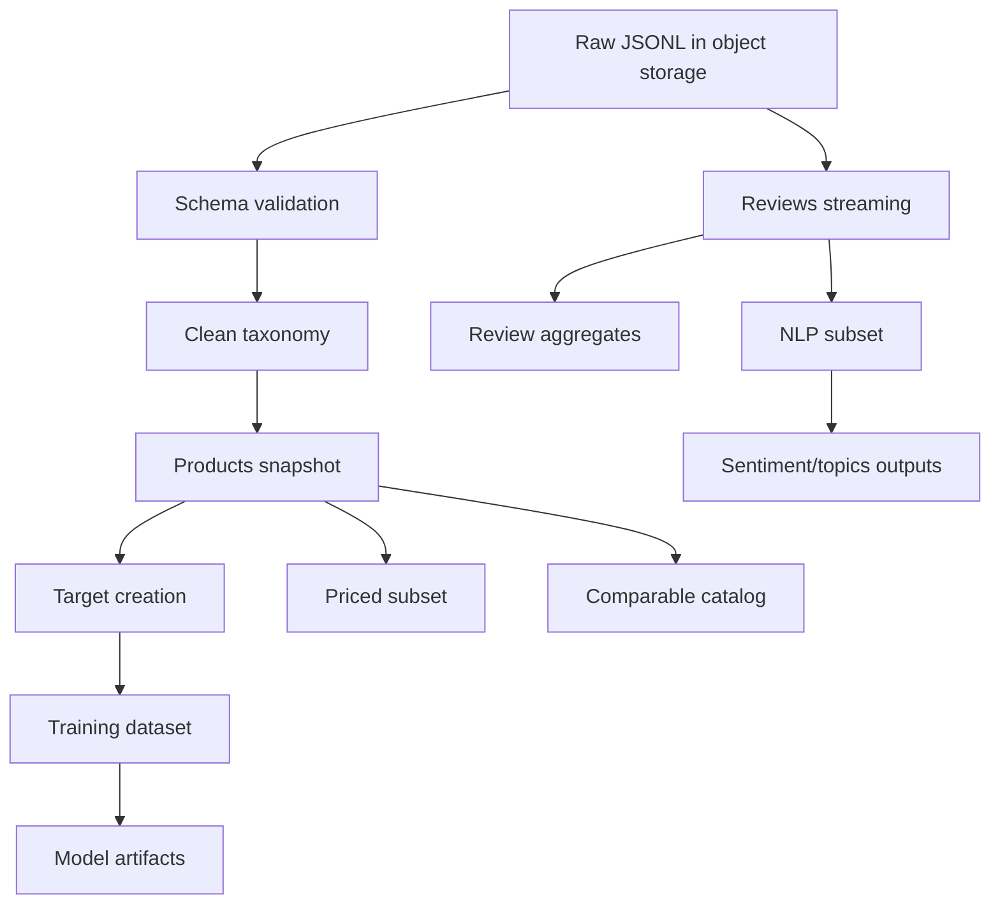

# Data, cleaning, and pipeline

## 1. Sources

- Amazon Reviews'23 metadata for Beauty and Personal Care.
- Amazon Reviews'23 reviews for Beauty and Personal Care.
- Optional external sources: trends, fees, and name or actuarial data.

## 2. Confirmed notebook status

The current notebook performed:

| Step | Observed result |
|---|---|
| Initial sampling | 20,000 metadata + 20,000 reviews |
| Products with non-null price | 380,680 |
| Products with valid numeric price | 380,618 |
| Reviews scanned | 23,911,390 |
| Unique products in reviews | 1,028,731 |
| Products with price and at least 50 reviews | 48,684 |
| Rows removed because `main_category` was null or empty | 929 |
| Final products in current CSV | 47,755 |
| Reviews retained for those ASINs | 13,807,823 |
| Empty columns removed | `bought_together`, `subtitle`, `author` |

## 3. Critical finding

The current CSV is filtered by:

1. Available price.
2. At least 50 reviews.
3. Non-null `main_category`.

This is useful for review NLP and popular comparables, but it is risky for the success model:

- It removes low-performing products.
- It introduces survivorship bias.
- The target depends on review volume, so filtering by volume before labeling reduces the negative class artificially.
- It removes 63 percent of products with no price, even though missing price can itself be a signal.
- `main_category` was identified as noise; the reliable taxonomy is `categories[1]`.

## 4. Required datasets

### Dataset A - `catalog_training_all`

Used for the success classifier.

- All products with valid real taxonomy.
- No minimum review threshold.
- Keep null price plus `price_is_missing`.
- Use rating and reviews only to create the target.

### Dataset B - `catalog_priced_subset`

Used for price-fit, price sweep, and price models.

- Only records with a valid numeric price.
- Treat outliers with documented rules.
- Never replaces Dataset A.

### Dataset C - `reviews_nlp_subset`

Used for sentiment, topics, and recurring complaints.

- Products with a configurable minimum volume, for example at least 50 reviews.
- Tag verified and unverified reviews.
- Partition by subcategory and year.

### Dataset D - `app_comparables_catalog`

Used for online inference.

- 20k to 100k representative products.
- Normalized embeddings.
- Lightweight fields for cards.
- No full text for millions of reviews.

## 5. Proposed pipeline



## 6. Format and storage

- Raw: compressed JSONL in object storage.
- Processed: Parquet + Zstandard.
- Partitions: `subcategory=.../year=...` for reviews.
- BI outputs: Parquet or small CSV.
- Manifests: JSON or YAML with checksum, date, and schema.

## 7. Data structure in Git

```text
data/
├── fake/        # small synthetic samples
├── raw/         # .gitignore, external files
├── processed/   # .gitignore, local outputs
└── external/    # documentation/manifests, no sensitive data
```

## 8. P0 validations

- Uniqueness of `parent_asin` in the catalog.
- Data types for rating, price, timestamps, and booleans.
- Taxonomy limited to the 8 valid subcategories.
- Counts before and after each filter.
- Target distribution by subcategory.
- Duplicate reviews.
- Join coverage between products and reviews.
- Automatic leakage audit.
