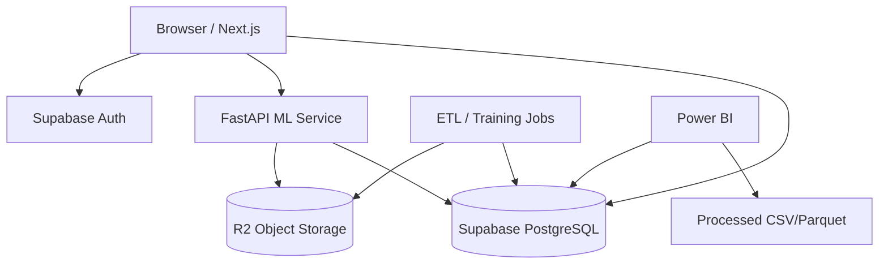

# Architecture and hosting

## 1. Recommended stack

| Layer | Technology | Reason |
|---|---|---|
| Frontend | Next.js + React + TypeScript | Migrates the HTML to maintainable components |
| UI | Tailwind CSS + chart library | Reproduce the responsive MVP |
| Auth/DB | Supabase | Auth, PostgreSQL, RLS, results, and portfolio |
| ML API | Python + FastAPI | Natural runtime for scikit-learn and CatBoost |
| Batch/ETL | Python + Polars/Pandas + DuckDB | Large files and Parquet |
| Object storage | Cloudflare R2 or S3-compatible | Raw, processed, embeddings, and models |
| BI | Power BI | EDA and output validation |
| Frontend hosting | Vercel or equivalent | Next.js deployment |
| API hosting | Cloud Run, Render, Railway, or another container host | Python service with controlled memory use |

The implementation-ready deployment procedure, environment-variable contract, Vercel CLI commands, Supabase redirect configuration, and current free FastAPI hosting alternatives are documented in the [Vercel Next.js and FastAPI deployment plan](plans/VERCEL_NEXTJS_FASTAPI_DEPLOYMENT_PLAN.md).

## 2. Supabase must not store the entire data lake

Supabase should store:

- Users and profiles.
- Analysis inputs.
- Summarized results.
- My Store portfolio.
- Model and dataset versions.
- Audit logs and jobs.

It should not store these in PostgreSQL tables:

- 11 GB raw JSONL.
- 13.8 million full reviews.
- Full embedding matrices.
- Multi-GB CSV files.

## 3. Strategy for more than 3 GB

### Recommendation

- R2: raw and processed datasets, Parquet, models, and embeddings.
- Supabase: object metadata and results.
- FastAPI: load needed artifacts at startup.
- Batch jobs: process in Colab initially and then in scheduled containers.

R2 is S3-compatible and built for objects and data lakes. Supabase Storage can also hold large files, but separating the data lake reduces coupling and gives better cost control.

## 4. GitHub

Git proper blocks files larger than 100 MiB. Git LFS has per-file limits and is not appropriate for an 11 GB review raw dataset. The repository will version only:

- Code.
- Notebooks without heavy outputs.
- Documentation.
- Small fake data.
- Manifests and checksums.
- Small metrics files.

## 5. Logical architecture

## 6. Environments

- `local`: fake data and stub model.
- `development`: Supabase dev and dev bucket.
- `staging`: candidate model and end-to-end tests.
- `production`: approved model and immutable snapshots.

## 7. Secrets

Never store these in Git:

- Supabase service role key.
- Database password.
- R2 or S3 credentials.
- Amazon Seller tokens.
- Trend provider keys.

Use environment variables and the hosting secret manager.

## 8. Minimum online artifacts

The online API must not load millions of reviews. It should load:

- Serialized pipeline or model.
- Threshold table.
- Reduced comparable index.
- Lightweight comparable metadata.
- Fee lookups and NameAge lookups if used.
