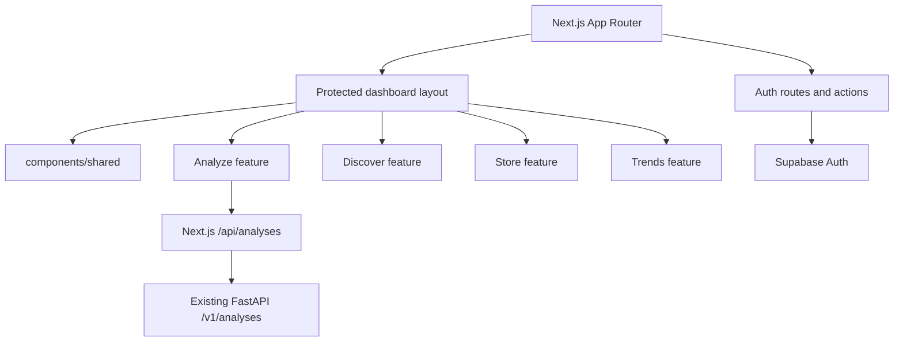
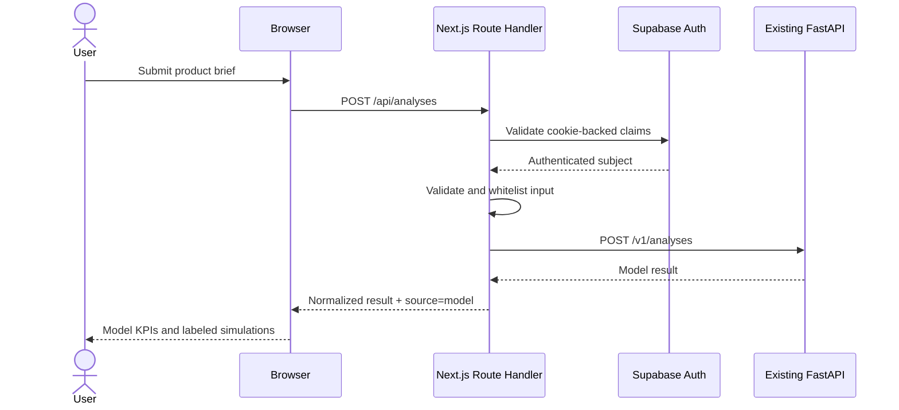

# Next.js frontend architecture

## Purpose and boundary

`src/frontend/` is the production-structured replacement for `AmazonProject.html`. It owns presentation, Supabase Auth session handling, route protection, validation, deterministic demo state, and a server-side proxy to the existing FastAPI service.

This milestone does not modify FastAPI, model artifacts, Supabase tables, RLS, Google Trends, or Amazon SP-API.

## Routes

| Route | Access | Responsibility |
|---|---|---|
| `/login` | Public | Password sign-in |
| `/register` | Public | Account registration |
| `/forgot-password` | Public | Recovery email request |
| `/reset-password` | Recovery session | New password |
| `/auth/confirm` | Public callback | OTP/code exchange |
| `/analyze` | Authenticated | Product analysis and results |
| `/discover` | Authenticated | Simulated opportunity catalog |
| `/store` | Authenticated | Local demo portfolio |
| `/trends` | Authenticated | Simulated momentum dashboard |
| `/api/analyses` | Authenticated | Validated FastAPI proxy |

## Component architecture

`components/shared/` contains visual primitives and states. Feature folders own domain behavior. `lib/api/` owns request/response schemas and deterministic fallback logic. `lib/supabase/` owns browser, server, and Proxy clients.

## Analysis sequence

If FastAPI is unavailable and local demo mode is enabled, the browser uses deterministic fallback data. Production should disable fallback so model failures are visible.

## Source labeling

| Label | Meaning |
|---|---|
| Model | Returned by the calibrated FastAPI model |
| Formula estimate | Transparent UI scenario, not an ML output |
| Simulation | Deterministic demonstration data |

Decision Risk is always presented as an index rather than failure probability. Profit and demand are never presented as real model predictions with the current API contract.

## Security boundary

- Supabase session cookies are refreshed by `proxy.ts`.
- Protected layouts and `/api/analyses` re-check claims.
- The FastAPI origin is server-only.
- Request bodies are validated and whitelisted with Zod.
- No service-role key belongs in Next.js.
- Direct FastAPI authentication remains a backend responsibility.

## Store boundary

The store is a demonstration portfolio saved in browser storage under the authenticated subject ID. It is intentionally labeled local/demo. The proposed persistent schema is documented in [Supabase Auth and database design](20_SUPABASE_AUTH_DATABASE.md).
