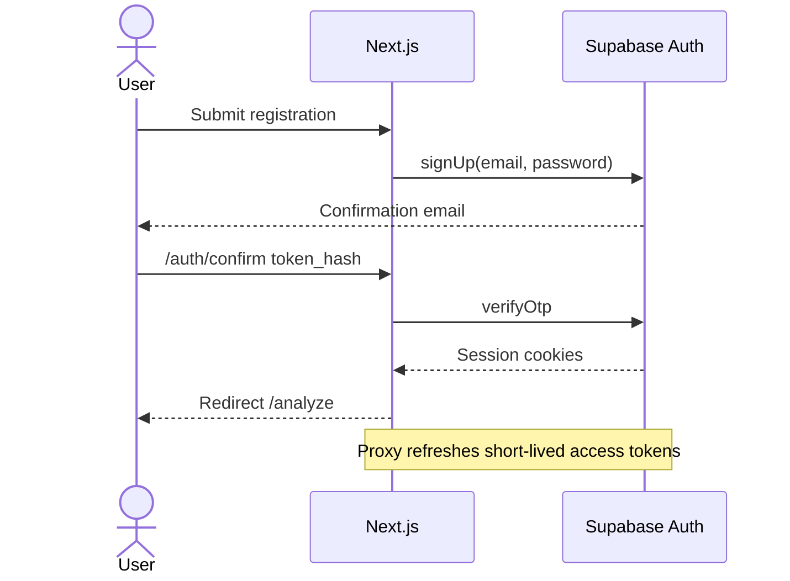
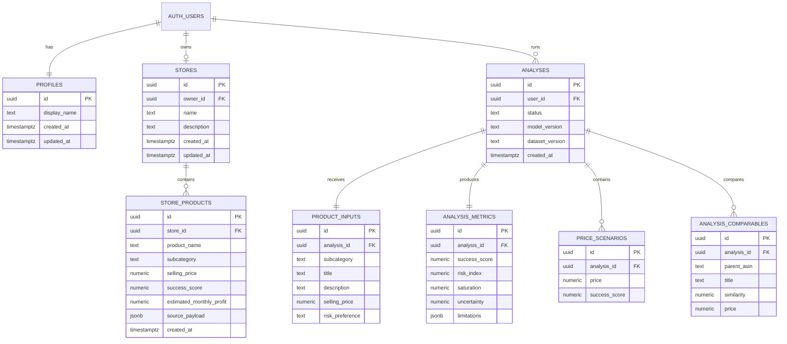

# Supabase Auth and proposed database design

## Current implementation

The Next.js application uses Supabase Auth only. It does not call the Supabase Data API and does not create application tables in this milestone.

### Auth endpoint map

The code uses `@supabase/ssr` and `@supabase/supabase-js`; the SDK owns the raw HTTP calls.

| Operation | SDK method | Underlying endpoint |
|---|---|---|
| Register | `auth.signUp()` | `POST /auth/v1/signup` |
| Password login | `auth.signInWithPassword()` | `POST /auth/v1/token?grant_type=password` |
| Refresh session | Managed by `@supabase/ssr` | `POST /auth/v1/token?grant_type=refresh_token` |
| Confirm email | `auth.verifyOtp()` | `POST /auth/v1/verify` |
| Exchange PKCE code | `auth.exchangeCodeForSession()` | `POST /auth/v1/token?grant_type=pkce` |
| Read claims/user | `auth.getClaims()` / `auth.getUser()` | Local JWKS verification or `GET /auth/v1/user` |
| Request recovery | `auth.resetPasswordForEmail()` | `POST /auth/v1/recover` |
| Set new password | `auth.updateUser()` | `PUT /auth/v1/user` |
| Logout | `auth.signOut()` | `POST /auth/v1/logout` |

No `/rest/v1/*` endpoint is used by the current frontend.

## Authentication sequence

## Proposed application database

The following schema is a future persistence design. It is not created by the Next.js milestone.

## Proposed ownership and RLS

- `profiles.id = auth.uid()` for self-read and self-update.
- `stores.owner_id = auth.uid()`; unique `owner_id` enforces one MVP store per account.
- Store-product policies authorize through the parent store.
- `analyses.user_id = auth.uid()`; users cannot provide or change another owner ID.
- Analysis child-table policies authorize through the parent analysis.
- All public-schema tables enable RLS and grant no anonymous access.
- Authorization never depends on editable `raw_user_meta_data`.
- A future service-role integration must remain server-only and derive ownership from a verified JWT.

## Current versus future

| Capability | Current Next.js milestone | Future persistence phase |
|---|---|---|
| Account/session | Supabase Auth | Same |
| Route protection | Next.js claims checks | Same plus API JWT validation |
| Analysis result | Returned transiently | Persisted under authenticated user |
| My Store | User-keyed local storage | `stores` and `store_products` with RLS |
| Data API | Not used | Authenticated `/rest/v1/*` or backend-owned persistence |
| RLS | Not applicable to Auth-only frontend | Required and integration-tested |

## Secret and redirect rules

- Browser: project URL and publishable key only.
- Never expose secret/service-role keys through `NEXT_PUBLIC_*` variables.
- Local redirect allow-list: `/auth/confirm` and `/reset-password` on `http://localhost:3000`.
- Production redirect allow-list must use the exact HTTPS deployment origin.
- FastAPI JWT verification and database writes are deliberately outside this frontend-only change.
