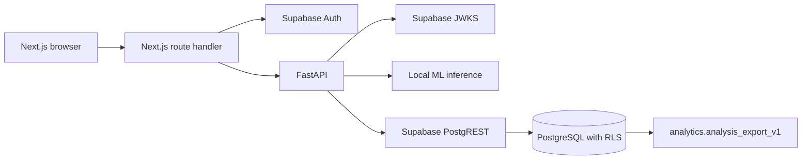

# Backend architecture

## Runtime topology

The browser never receives the FastAPI origin or a privileged database key.
Next.js calls `getClaims()` before reading the access token from the session.
FastAPI verifies signature, issuer, audience, expiration, subject, and role. It
then sends the publishable key plus the user JWT to PostgREST. No service-role
key is used in the user request path.

## FastAPI structure

- `app/core`: settings, JWKS verification, request IDs, and errors.
- `app/clients`: user-scoped Supabase REST client.
- `app/repositories`: persistence and cursor pagination.
- `app/services`: inference orchestration and finance formulas.
- `app/routers`: system, analysis, store, and shortlist endpoints.
- `inference.py`: existing calibrated model and comparable-product engine.

`src/api/main.py` remains a compatibility entrypoint for `uvicorn main:app`.

## Analysis transaction

1. Validate the authenticated request with Pydantic.
2. Run calibrated inference and comparable lookup.
3. Calculate fees, profit per sale, and optional monthly profit.
4. Call `persist_analysis` with the user JWT.
5. PostgreSQL inserts the header, input, metrics, curve, comparables, and audit
   event in one transaction.
6. Return the persisted analysis ID and request ID.

Repeated `request_id` values return the original analysis.
