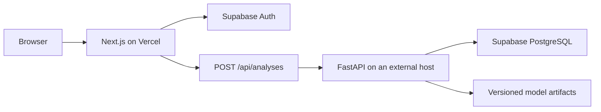

# Vercel Next.js and FastAPI Deployment Plan

> **Status:** Implementation-ready plan
> **Last verified:** 2026-07-20
> **Deployment scope:** Next.js on Vercel; FastAPI on a separate provider

## 1. Objective

Deploy the application in `src/frontend` to Vercel with Supabase authentication and a server-side connection to the separately hosted FastAPI service.

This document does not authorize or perform a deployment. It defines the required code changes, environment variables, CLI procedure, validation, and rollback process.



## 2. Preconditions and deployment blockers

Complete these items before treating the deployment as production-ready:

1. **Forward the authenticated user token.** The Next.js `/api/analyses` handler currently validates Supabase claims but does not forward the access token. FastAPI requires `Authorization: Bearer <token>`, so the handler must forward the token after validating the session.
2. **Resolve the public site URL by environment.** Use `NEXT_PUBLIC_SITE_URL` for production, the Vercel-provided deployment URL for Preview, and `http://localhost:3000` for local development.
3. **Make Supabase email redirects environment-aware.** Confirmation and recovery emails must return to the originating Preview URL or the exact production URL.
4. **Provide the FastAPI HTTPS URL.** Vercel cannot reach `127.0.0.1`; `FASTAPI_URL` must be the externally deployed API origin.
5. **Distribute model artifacts outside Git.** The required model and catalog files are ignored by Git. The backend deployment must download a versioned artifact bundle from private object storage or receive the artifacts in a private container image.
6. **Validate cold-start behavior.** The current Next.js proxy aborts FastAPI requests after eight seconds. A free backend that scales to zero may require a longer bounded timeout, a controlled retry, and a visible `Backend warming up` state.

No public request or response schema needs to change. The integration change is limited to forwarding the authenticated Supabase JWT from Next.js to the existing FastAPI contract.

## 3. Required environment variables

### 3.1 Vercel variables

| Variable | Production | Preview | Exposure | Notes |
|---|---|---|---|---|
| `NEXT_PUBLIC_SUPABASE_URL` | Supabase project URL | Same project or a staging project | Browser-safe | Must use HTTPS |
| `NEXT_PUBLIC_SUPABASE_PUBLISHABLE_KEY` | Supabase publishable key | Matching project key | Browser-safe | Never replace with a service-role key |
| `NEXT_PUBLIC_SITE_URL` | Exact production origin | Leave unset | Browser-safe | Example: `https://launchly-frontend.vercel.app` |
| `FASTAPI_URL` | Production FastAPI HTTPS origin | Staging or production API origin | Server-only | Do not add the `NEXT_PUBLIC_` prefix |
| `NEXT_PUBLIC_ENABLE_DEMO_MODE` | `false` | `false` | Browser-safe | Production failures must not silently become demo results |

Vercel separates Development, Preview, and Production values. Updating a value does not modify an existing deployment; create a new deployment after every relevant change.

### 3.2 FastAPI host variables

These values belong to the FastAPI provider, not Vercel:

| Variable | Production value |
|---|---|
| `APP_ENV` | `production` |
| `SUPABASE_URL` | Same Supabase project used by Next.js |
| `SUPABASE_PUBLISHABLE_KEY` | Supabase publishable key |
| `CORS_ORIGINS` | Exact production and approved Preview origins |
| `SUPABASE_TIMEOUT_SECONDS` | `10` initially; tune from measured latency |

Do not expose database passwords, Supabase service-role keys, object-storage credentials, or Vercel tokens as `NEXT_PUBLIC_*` variables.

## 4. Pre-deployment code changes

### 4.1 Authenticated FastAPI proxy

Update the Next.js analysis Route Handler to:

1. Create the server-side Supabase client.
2. Validate the session with `getClaims()`.
3. Obtain the access token from the same validated session.
4. Reject missing or invalid sessions with `401`.
5. Send `Authorization: Bearer <access_token>` to `POST {FASTAPI_URL}/v1/analyses`.
6. Preserve the current request and response schema validation.
7. Continue returning controlled `422`, `502`, and `503` responses without exposing provider details.

### 4.2 Environment-aware site URL

Centralize URL resolution in one helper with this precedence:

1. `NEXT_PUBLIC_SITE_URL` when explicitly configured.
2. `https://${VERCEL_URL}` when running on a Vercel Preview.
3. `http://localhost:3000` locally.

Normalize the result to remove a trailing slash before appending `/auth/confirm` or `/reset-password`.

### 4.3 Cold-start policy

- Keep a bounded FastAPI request timeout.
- If the selected free host regularly exceeds eight seconds after sleeping, raise the timeout only within the Vercel plan's function-duration limit.
- Return a distinct warming-up response and allow one user-triggered retry.
- Do not retry validation errors, authentication errors, or successful requests.
- Do not enable silent demo fallback in Production.

## 5. Supabase production and Preview configuration

In **Supabase Dashboard > Authentication > URL Configuration** configure:

- Site URL: `https://launchly-frontend.vercel.app`
- Additional redirect: `http://localhost:3000/**`
- Additional redirect: `https://launchly-frontend.vercel.app/**`
- Preview wildcard: `https://*-<vercel-account-or-team-slug>.vercel.app/**`

Replace the example project name and account slug with the values assigned during `vercel link`.

Use exact URLs for Production and a wildcard only for Vercel Preview deployments. Configure the confirmation template to use the redirect destination rather than a hard-coded localhost origin. Validate confirmation and recovery templates separately because they use different authentication flows.

Reference: [Supabase redirect URLs](https://supabase.com/docs/guides/auth/redirect-urls).

## 6. Vercel CLI deployment procedure

### 6.1 Local prerequisites

- Node.js 22 or 24 LTS; Next.js requires Node.js 20.9 or newer.
- pnpm installed through Corepack or available as `pnpm.cmd` on Windows.
- A Vercel account.
- A reachable FastAPI HTTPS URL.
- A clean, reviewed `main` branch for Production.

Verify the local toolchain:

```powershell
node --version
pnpm.cmd --version
git branch --show-current
git status --short
```

Do not continue if the repository has unresolved merge conflicts.

### 6.2 Validate the frontend

```powershell
cd src/frontend
pnpm.cmd install --frozen-lockfile
pnpm.cmd typecheck
pnpm.cmd lint
pnpm.cmd test
pnpm.cmd build
```

### 6.3 Authenticate and link the project

Run the CLI from `src/frontend` so Vercel treats that directory as the Next.js project root:

```powershell
pnpm dlx vercel@latest login
pnpm dlx vercel@latest link
```

During project linking:

- Select the intended personal or team scope.
- Create or link the project named `launchly-frontend`.
- Confirm that the current directory is `./`.
- Accept the detected Next.js build settings.
- Ensure the generated `.vercel/` directory is ignored by Git.

Reference: [Vercel project linking](https://vercel.com/docs/cli/project-linking).

### 6.4 Add Production variables

Each command prompts for the value without placing it directly in the shell history:

```powershell
pnpm dlx vercel@latest env add NEXT_PUBLIC_SUPABASE_URL production
pnpm dlx vercel@latest env add NEXT_PUBLIC_SUPABASE_PUBLISHABLE_KEY production
pnpm dlx vercel@latest env add NEXT_PUBLIC_SITE_URL production
pnpm dlx vercel@latest env add FASTAPI_URL production
pnpm dlx vercel@latest env add NEXT_PUBLIC_ENABLE_DEMO_MODE production
```

Enter `false` for `NEXT_PUBLIC_ENABLE_DEMO_MODE`.

### 6.5 Add Preview variables

```powershell
pnpm dlx vercel@latest env add NEXT_PUBLIC_SUPABASE_URL preview
pnpm dlx vercel@latest env add NEXT_PUBLIC_SUPABASE_PUBLISHABLE_KEY preview
pnpm dlx vercel@latest env add FASTAPI_URL preview
pnpm dlx vercel@latest env add NEXT_PUBLIC_ENABLE_DEMO_MODE preview
```

Do not add `NEXT_PUBLIC_SITE_URL` to Preview. The URL helper must use Vercel's deployment URL.

Audit variable names without printing their values:

```powershell
pnpm dlx vercel@latest env ls production
pnpm dlx vercel@latest env ls preview
```

Reference: [Vercel environment variables](https://vercel.com/docs/environment-variables).

### 6.6 Create and validate a Preview

```powershell
pnpm dlx vercel@latest
```

The CLI prints the unique Preview URL. Add the actual account/team wildcard to the Supabase redirect allowlist before testing email authentication.

Inspect a deployment when necessary:

```powershell
pnpm dlx vercel@latest inspect <preview-url>
pnpm dlx vercel@latest logs <preview-url>
```

### 6.7 Create the Production deployment

After the Preview acceptance checks pass and the intended code is on `main`:

```powershell
git branch --show-current
pnpm dlx vercel@latest --prod
```

The command creates a Production deployment and assigns the configured production domain. Reference: [Deploying with Vercel CLI](https://vercel.com/docs/cli/deploying-from-cli).

If Git-based continuous deployment is enabled later, configure `src/frontend` as the Vercel Root Directory. Use `main` as the Production branch and other branches for Preview deployments.

## 7. FastAPI hosting alternatives

FastAPI must not be deployed as part of the Vercel frontend project.

### 7.1 Render Free

Best for the simplest no-cost demonstration deployment.

- Supports Python web services and the standard command `uvicorn main:app --host 0.0.0.0 --port $PORT`.
- Provides 750 free instance hours per workspace per month.
- Spins down after 15 minutes without inbound traffic.
- Cold start can take approximately one minute.
- Uses an ephemeral filesystem and does not provide a persistent disk on the free instance.

This option requires solving the Next.js timeout and model-artifact download before use.

References: [Render Free services](https://render.com/docs/free) and [Render FastAPI deployment](https://render.com/docs/deploy-fastapi).

### 7.2 Koyeb Free

Best for a Git- or Docker-driven demonstration that sleeps less frequently.

- Provides one free instance per organization.
- Current free-instance resources are 512 MB RAM, 0.1 vCPU, and 2 GB SSD.
- Scales to zero after one hour without traffic.
- Supports monorepo work directories, buildpacks, Dockerfiles, and pre-built containers.

Benchmark model loading and inference before choosing this option; 512 MB and 0.1 vCPU may be insufficient.

References: [Koyeb instances](https://www.koyeb.com/docs/reference/instances) and [Koyeb FastAPI deployment](https://www.koyeb.com/docs/deploy/fastapi).

### 7.3 Google Cloud Run

Recommended technical fit when a billing account is acceptable.

- Supports containerized FastAPI and deployment from source.
- Scales to zero and allows explicit CPU and memory configuration.
- The request-based free tier currently includes monthly CPU, memory, and request allowances.
- A Google Cloud billing account is required, and usage outside the allowances can generate charges.

Configure budgets and billing alerts before deployment.

References: [Cloud Run FastAPI quickstart](https://docs.cloud.google.com/run/docs/quickstarts/build-and-deploy/deploy-python-fastapi-service) and [Cloud Run pricing](https://cloud.google.com/run/pricing).

### 7.4 Selection rule

1. Measure the model bundle size and peak resident memory during startup and one analysis.
2. Reject a provider whose memory limit is below the measured peak plus at least 25% headroom.
3. For a no-card demo, trial Render first and validate cold-start behavior.
4. For heavier models, prefer Cloud Run with a configured budget.
5. Do not deploy until the artifact source, version, checksum, and startup failure behavior are defined.

## 8. Acceptance tests

### Build and configuration

- `pnpm.cmd typecheck`, `lint`, `test`, and `build` pass under Node.js 22 or 24.
- Vercel recognizes `src/frontend` as the Next.js root.
- Production and Preview contain every required variable.
- `FASTAPI_URL` is absent from browser bundles and client-visible configuration.
- No secret or `.vercel` project metadata is committed.

### Authentication

- An anonymous `/analyze` request redirects to `/login`.
- Registration from Preview returns to that Preview deployment.
- Registration from Production returns to the production domain.
- Password recovery returns to `/reset-password` on the correct origin.
- An expired or invalid session receives `401` and is never forwarded as authenticated.

### Analysis integration

- Next.js sends the validated bearer token to FastAPI.
- FastAPI validates the token against the configured Supabase project.
- A valid analysis returns `source: "model"`.
- Validation failures remain `422`.
- Backend unavailability produces a controlled error and does not silently show demo results.
- The first request after a free-host cold start either succeeds within the configured limit or shows the warming-up state and permits one retry.

### Production smoke test

- Login, logout, confirmation, and password recovery work.
- Analyze loads and the interactive price chart responds.
- `/health` on FastAPI responds over HTTPS.
- Browser developer tools show no mixed-content, CORS, or uncaught runtime errors.
- Security headers from `next.config.ts` remain present.

## 9. Rollback and operations

- Keep the previous successful Production deployment available in Vercel.
- If the smoke test fails, restore the previous deployment from Vercel before investigating.
- Review Vercel function logs and FastAPI request IDs together.
- Never log access tokens, cookies, passwords, environment values, or complete user payloads.
- Redeploy after changing any `NEXT_PUBLIC_*` value because public values are embedded during the build.

## 10. Assumptions and limitations

- The first deployment uses the free `vercel.app` domain; custom DNS is a later step.
- Preview deployments support complete Supabase authentication.
- FastAPI remains a separately deployed authenticated service.
- Production never enables demo fallback.
- This plan compares backend providers but does not deploy one.
- The Vercel Hobby plan is suitable only for personal or non-commercial use under the current terms. A commercial supermarket deployment must use an eligible paid plan or another provider. See [Vercel Terms of Service](https://vercel.com/legal/terms).
- Provider pricing and free-tier limits can change. Recheck the linked official documentation immediately before deployment.
